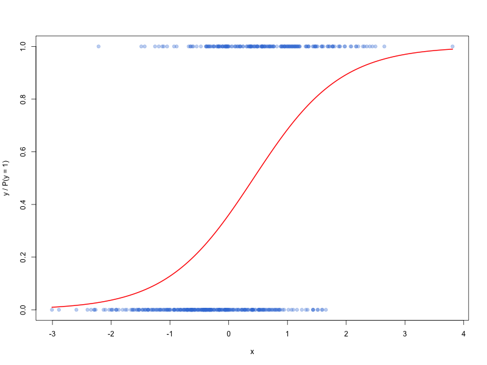
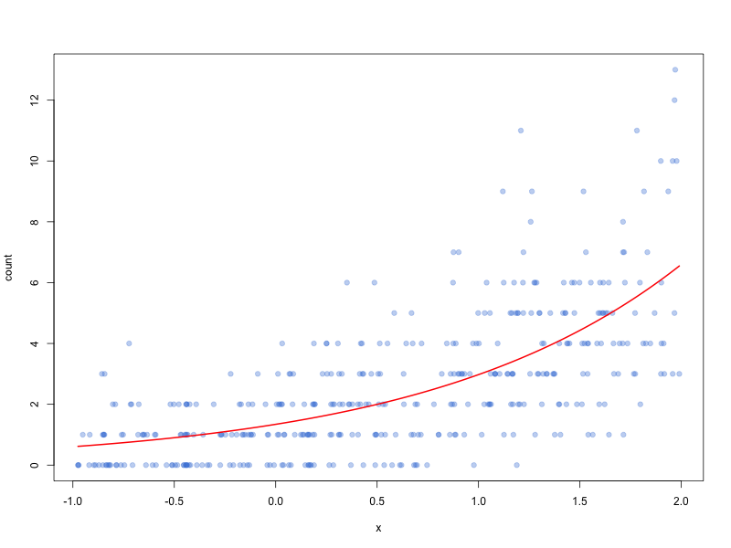

# learning_cpp

A collection of functions implementing well-known statistical estimators in C++,
written as a way of learning C++ (with RcppArmadillo, called from R).

## Layout

```
estimators/   C++ estimator functions (ols.cpp, ridge.cpp, logit.cpp, poisson.cpp)
examples/     R scripts demonstrating them
```

## OLS

An ordinary least squares estimator. `ols_full()` returns the coefficients and
their standard errors from `(X'X)^-1 X'y`.

```r
library(Rcpp)
sourceCpp("estimators/ols.cpp")

fit <- ols_full(cbind(1, x), y)
fit$coefficients   # intercept, slope
fit$stderr         # standard errors
```

## Ridge

A ridge regression estimator (L2-penalised OLS). `ridge_full()` returns the
coefficients from `(X'X + lambda*I)^-1 X'y` for a given penalty `lambda`. The
intercept (first column) is left unpenalised.

```r
library(Rcpp)
sourceCpp("estimators/ridge.cpp")

fit <- ridge_full(cbind(1, x), y, lambda = 10)
fit$coefficients   # intercept, slope
fit$lambda         # penalty used
```

## Logistic

A logistic regression estimator fit by iteratively reweighted least squares
(Newton-Raphson). `logit_full()` returns the coefficients and their standard
errors; it matches R's `glm(..., family = binomial)`.

```r
library(Rcpp)
sourceCpp("estimators/logit.cpp")

fit <- logit_full(cbind(1, x), y)
fit$coefficients   # intercept, slope (log-odds scale)
fit$stderr         # standard errors
```

## Poisson

A Poisson regression estimator (log link) fit by iteratively reweighted least
squares. `poisson_full()` returns the coefficients and their standard errors;
it matches R's `glm(..., family = poisson)`.

```r
library(Rcpp)
sourceCpp("estimators/poisson.cpp")

fit <- poisson_full(cbind(1, x), y)
fit$coefficients   # intercept, slope (log scale)
fit$stderr         # standard errors
```

## Examples

Run from the repository root.

`examples/example.R` overlays the OLS fit with ridge fits at increasing
`lambda` — the slope visibly shrinks toward zero as the penalty grows:

```sh
Rscript examples/example.R
```


`examples/logit_example.R` plots the fitted probability curve over binary data:

```sh
Rscript examples/logit_example.R
```



`examples/poisson_example.R` plots the fitted mean curve over count data:

```sh
Rscript examples/poisson_example.R
```


